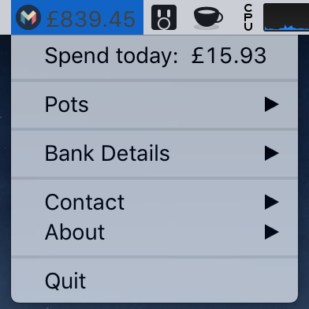
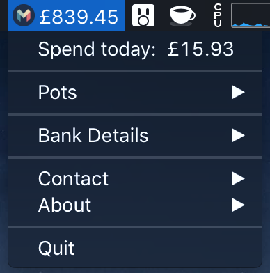

# Bankbar: Monzo on your desktop.

A small project using the [Monzo API](https://docs.monzo.com/), mostly to get my around OAuth2.

Light theme:

Dark theme:

## Disclaimer
- All details and tokens are stored locally and are never saved or sent anywhere else.
- The api will almost definitely change in future, so the app may break at any time. I will try and update as soon as I can if this happens.

## Features
- Shows your balance the menubar.
- Shows todays spend.
- Quick access to bank info (sort code/account number) with ability to quickly copy details.

A few features I would like to add:
- Pot Balances.
- Recent Transactions. This is hard at the moment as the API doesn't let me download recent transactions without downloading ALL of them. This is very slow. I may just implement todays transactions, rather than the last 5 or 10. Not very usefull immediately after midnight..
- Notifications. Currently not possible as the API doesn't support WebSockets.
- Make the application more non-dev user friendly.

## Limitations
Due to Monzo only allowing 20 users per OAuth application, I am unable to distribute a fully packaged app. There are instructions below on how you can do this yourself.

Unfortunately Monzo won't be lifting the limit anytime soon due to apps potentially not being PSD2 compliant.

## Prerequisites:
  The following instructions assume you:
  - are comfortable using the command line & editing files.
  - know how to use git and have it setup on your computer.
  - have nodejs installed. Download and install the latest LTS macOS Installer from [here](https://nodejs.org/en/download/) if you don't.

## Installation
#### (macOS only)
###### Aquire application credentials:
- Go to the [Developers Portal](https://developers.monzo.com/) and sign in with the email address associated with your Monzo account.
- Go to [Clients](https://developers.monzo.com/apps/home) in the top right corner, and create a New OAuth Client.
- Fill in the blanks but make sure that: `Redirect URLs` is set to `http://127.0.0.1:3456/` and `Confidentiality` is set to `Confidential`.

###### Add credentials to the application:
- Open up your terminal app and clone the repository: `git clone git@github.com:johneas10/bankbar`
- Copy _.env.example_ as _.env_:  `cp .env.example .env`
- Add your credentials to _.env_ using the details you have from your application hosted on the Monzo Developers Portal.

At this point you can just run `npm install` and `npm start` to kick off the application. This isn't too convenient, as you would have to run this everytime to start yout app. So carry on with the following steps to build your application and add it to your application folder.

###### Run the build script to create .dmg:
- Run `npm run dist` to begin the build process. This will create a `dist` directory within the repository.
- Open the `.dmg` image within that directory.
- Copy bankbar into your application folder.
-  🔝

## Built With
- [Electron](https://electronjs.org/)
- [Monzo API](https://docs.monzo.com/)

## Contributing
1. Fork it <https://github.com/johneas10/bankbar/fork>
2. Create your feature branch `git checkout -b feature/more_monzo`
3. Commit your changes with [commitizen](https://www.npmjs.com/package/commitizen) `npm run commit`
4. Push to the branch `git push origin feature/more_monzo`
5. Create a new Pull Request against the Master branch.

## License
Distributed under the MIT license. See `LICENSE` for more information.