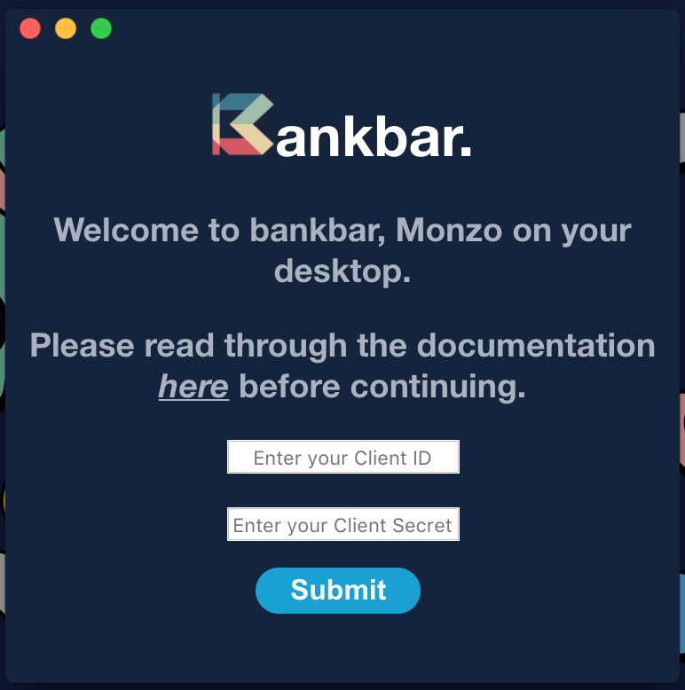

# Bankbar: Monzo on your desktop.

A small project using the [Monzo API](https://docs.monzo.com/), mostly to get my head around OAuth2.

Login screen:

Light theme:

Dark theme:

## Disclaimer
- All details and tokens are stored locally and are never saved or sent anywhere else.
- The api will almost definitely change in future, so the app could break at any time. I will try and update as soon as I can if this happens.

## Features
- Shows your balance the menubar.
- Shows todays spend & transactions.
- Shows pot balances.
- Quick access to bank info (sort code/account number) with ability to quickly copy details.

A few features I would like to add:
- Instant notifications. Currently not possible as the API doesn't support WebSockets.

## Limitations
Due to Monzo only allowing 20 users per OAuth application, I am unable to distribute a fully packaged app. There are instructions below on how you can do this yourself.

Unfortunately Monzo won't be lifting this limit anytime soon due to apps potentially not being PSD2 compliant.

## Installation
#### (macOS only)
###### Aquire application credentials:
- Go to the [Developers Portal](https://developers.monzo.com/) and sign in with the email address associated with your Monzo account.
- Go to [Clients](https://developers.monzo.com/apps/home) in the top right corner, and create a New OAuth Client.
- Fill in the blanks but make sure that: `Redirect URLs` is set to `https://johneas.io/bankbar/auth/` and `Confidentiality` is set to `Confidential`.

_Please note:_

_The redirect URL is currently setup as a proxy and doesn't save any information. This was implemented because some email clients were stripping out custom protocols. The code can be found [here](https://github.com/johneas10/bankbar-proxy)._

###### Download application & enter your credentials:
- Download the latest _.dmg_ from [here](https://github.com/johneas10/bankBar/releases) and copy the application to your applications folder.
- Start the application and enter the `Client ID` and `Client secret` provided by Monzo for your new OAuth Client.
-  🔝

#### (Developer instructions)
- Open up your terminal app and clone the repository: `git clone git@github.com:johneas10/bankbar`.
- run `npm install` and `npm start` to get a local build started.
- run `npm run dist` to build your own version locally. You can find your local build in a new directory called _dist_ within the root of the repository.

## Built With
- [Electron](https://electronjs.org/)
- [Monzo API](https://docs.monzo.com/)

## Contributing
1. Fork it <https://github.com/johneas10/bankbar/fork>
2. Create your feature branch `git checkout -b feature/more_monzo`
3. Commit your changes with [commitizen](https://www.npmjs.com/package/commitizen) `npm run commit`
4. Push to the branch `git push origin feature/more_monzo`
5. Create a new Pull Request against the Master branch.

## License
Distributed under the MIT license. See `LICENSE` for more information.